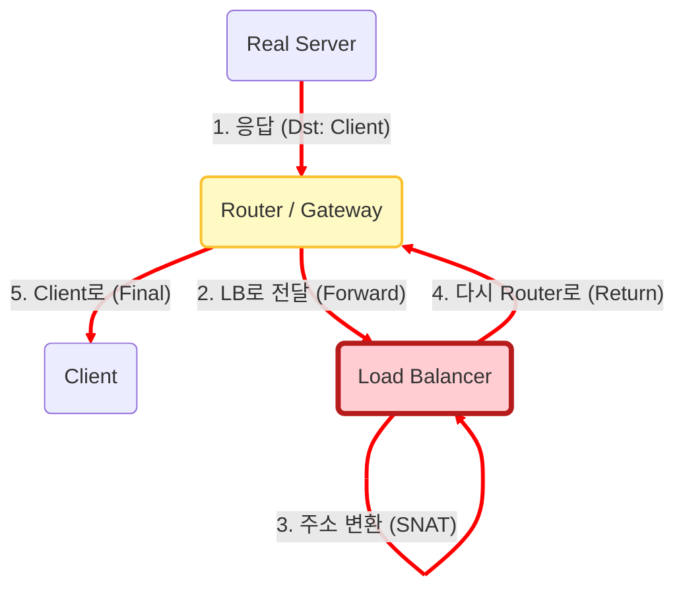
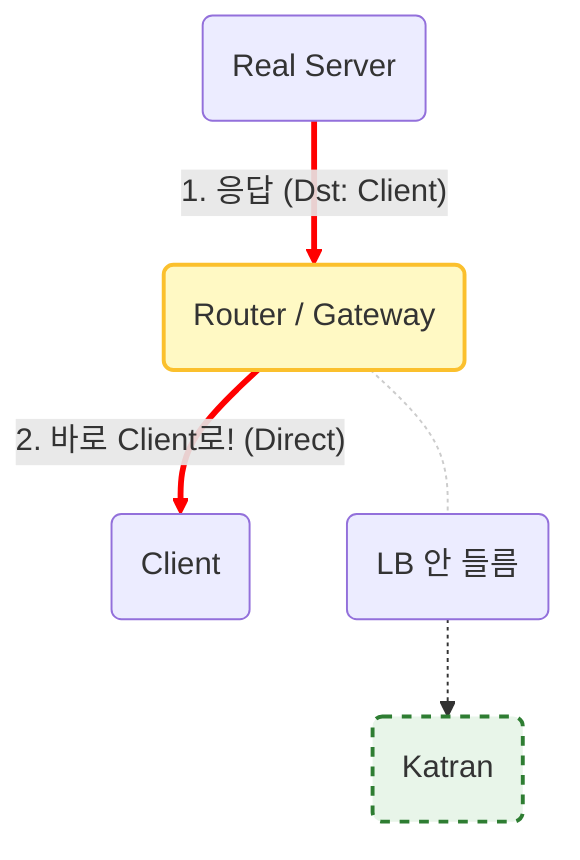
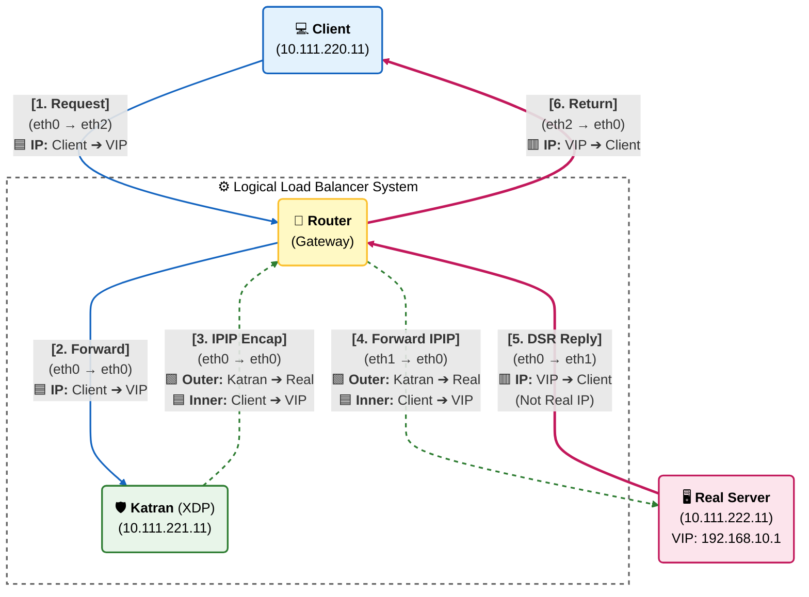

# Network Architecture & Packet Flow

이 프로젝트는 **XDP(eBPF)**를 활용한 **DSR(Direct Server Return)** 로드 밸런서를 구현합니다.
일반적인 로드 밸런서(NAT)와 DSR 방식의 차이점, 그리고 패킷의 상세 흐름은 아래와 같습니다.

---

## Architecture Comparison (NAT vs DSR)

로드 밸런싱의 핵심은 "응답 패킷(Response)이 돌아오는 경로"에 있습니다.

### A. 일반적인 로드 밸런서 (NAT/Proxy 방식)
응답 트래픽이 반드시 로드 밸런서(LB)를 **다시 거쳐야** 합니다.
대용량 트래픽 처리 시 **LB가 병목(Bottleneck)**이 될 수 있습니다.

### B.우리가 구현한 Katran (DSR 방식)
응답 트래픽이 LB를 거치지 않고 Router를 통해 Client로 직접(Direct) 전달됩니다. LB의 부하를 획기적으로 줄여 압도적인 성능을 제공합니다.

##  Detailed Packet Flow (XDP Implementation)
XDP 프로그램(Katran)이 패킷을 어떻게 캡슐화(Encap) 하고, Real Server가 어떻게 변조(Spoofing) 하여 응답하는지 보여주는 상세 흐름도입니다.

- 🟦 Blue: 원본 요청 (Client → VIP)
- 🟩 Green: IPIP 터널링 (Katran → Real Server)
- 🟥 Red: DSR 응답 (Real Server [VIP] → Client)

