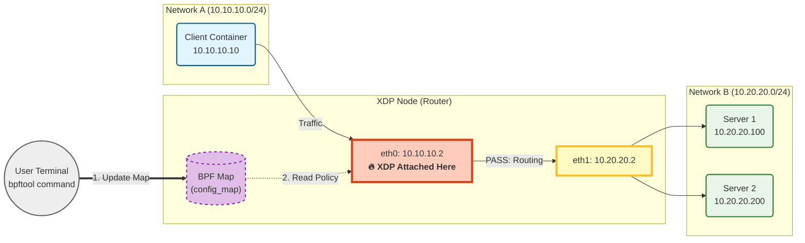

패킷의 내부 데이터(헤더)를 들여다보고 판단하는 로직을 작성



```shell
docker exec -it xdp-node /bin/bash
./ctl.sh s1    # 서버 1 모드로 변경
./ctl.sh drop  # 드랍 모드로 변경

bpftool map dump name config_map
```

```shell
docker exec -it xdp-node bpftool map update name config_map key 0 0 0 0 value 0 0 0 0
docker exec -it client ping 10.20.20.100
docker exec -it client ping 10.20.20.200
```

```shell
docker exec -it xdp-node bpftool map update name config_map key 0 0 0 0 value 1 0 0 0
docker exec -it client ping 10.20.20.100
docker exec -it client ping 10.20.20.200
```

```shell
docker exec -it xdp-node bpftool map update name config_map key 0 0 0 0 value 2 0 0 0
docker exec -it client ping 10.20.20.100
docker exec -it client ping 10.20.20.200
```
```shell
docker exec -it xdp-node bpftool map dump name config_map
```
이더넷 헤더 파싱 및 패킷 크기 검증
1. ctx->data(시작)와 ctx->data_end(끝) 포인터
2. data + sizeof(struct ethhdr) > data_end 조건을 검사하여 패킷이 너무 짧으면 패킷을 드롭하거나 종료
3. 이더넷 프로토콜 타입을 확인하여 다음 단계로 넘어갈 준비


```shell
docker exec -it xdp-sender ping -c 4 172.20.0.10
docker exec -it xdp-sender ping6 -c 4 fd00:dead:cafe::10
docker exec -it xdp-sender ping6 -c 4 -I eth0.100 fc00:100::10
```
