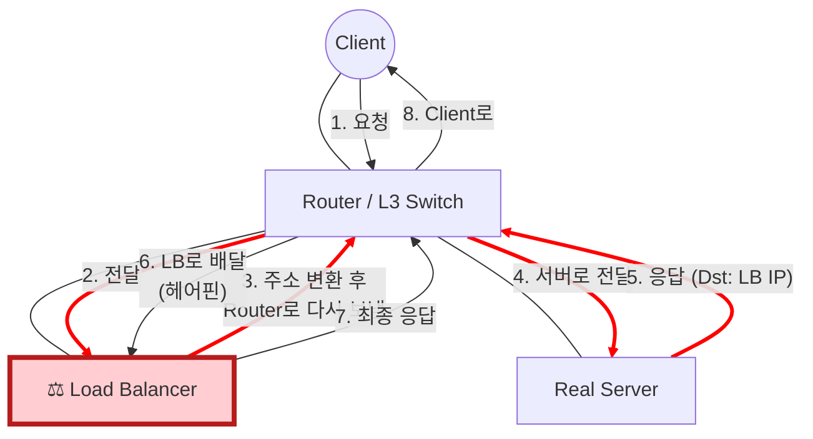
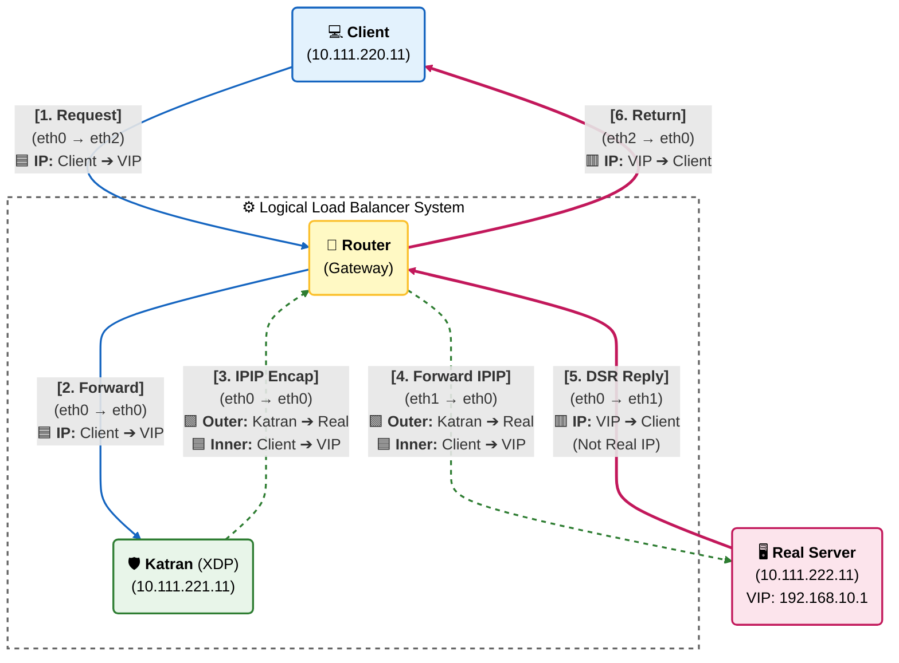

# 테스트 방법
```shell
docker exec -it client nc 192.168.10.1 50007
```


# 트러블 슈팅


# Network Architecture & Packet Flow

이 프로젝트는 **XDP(eBPF)**를 활용한 **DSR(Direct Server Return)** 로드 밸런서를 구현합니다.
일반적인 로드 밸런서(NAT)와 DSR 방식의 차이점, 그리고 패킷의 상세 흐름은 아래와 같습니다.

---

## Architecture Comparison (NAT vs DSR)

로드 밸런싱의 핵심은 "응답 패킷(Response)이 돌아오는 경로"에 있습니다.



##  Detailed Packet Flow (XDP Implementation)
XDP 프로그램(Katran)이 패킷을 어떻게 캡슐화(Encap) 하고, Real Server가 어떻게 변조(Spoofing) 하여 응답하는지 보여주는 상세 흐름도입니다.

- 🟦 Blue: 원본 요청 (Client → VIP)
- 🟩 Green: IPIP 터널링 (Katran → Real Server)
- 🟥 Red: DSR 응답 (Real Server [VIP] → Client)


